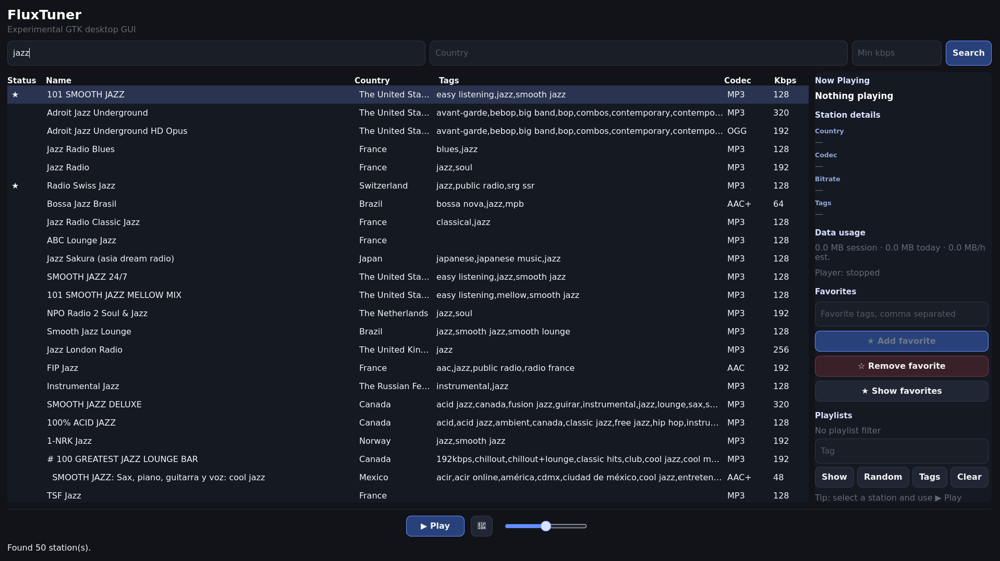
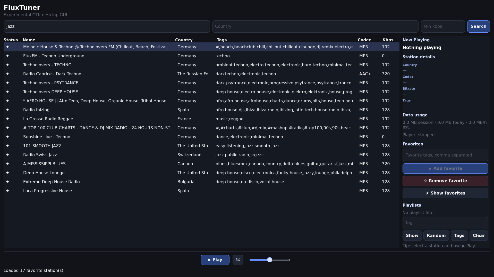
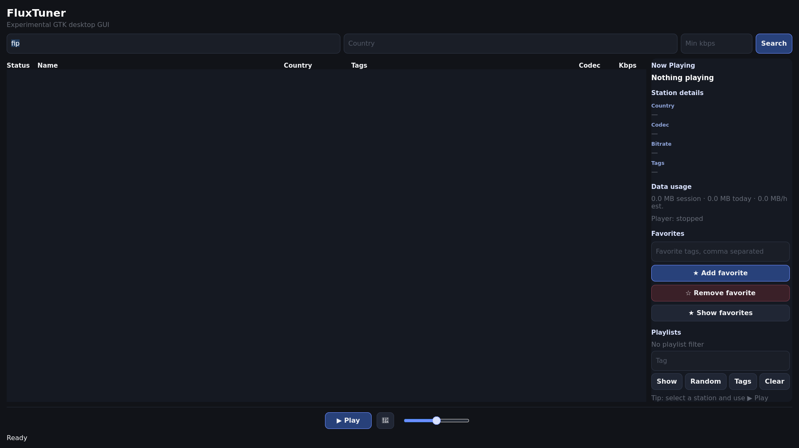
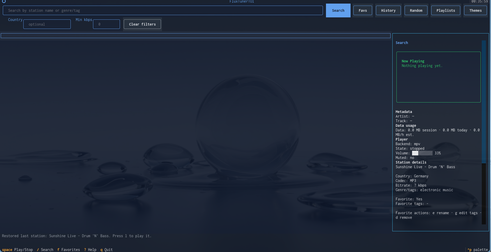
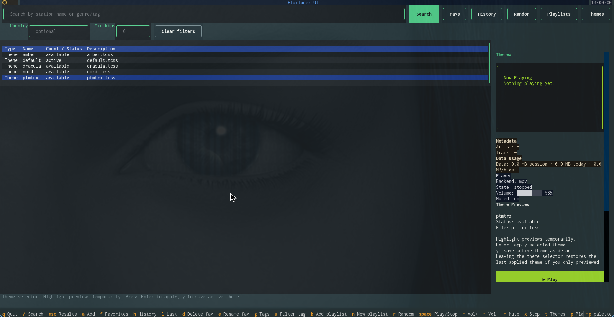

# FluxTuner


A modern internet radio player for the terminal and desktop.

FluxTuner combines:

* a fast keyboard-oriented TUI,
* an experimental GTK4 desktop GUI,
* smart favorites and playlists,
* theming support,
* and MPV-powered playback

into a lightweight application designed for daily use.

Built with Python, powered by mpv, and focused on speed, usability and modularity.

---

# Features

## Core Features

* Search internet radio stations by name, genre and country.
* Play streams with mpv.
* Favorites with custom names and tags.
* Smart Play by tag or playlist.
* Persistent playlists and dynamic tag playlists.
* Full theming system with live preview.
* Structured table view.
* Volume, mute and playback control.
* Estimated data usage tracking.
* Experimental GTK desktop GUI.
* Clean modular architecture.
* Live stream metadata display (artist and track when available)

---

# Screenshots

## GTK GUI — Search & Playback



## GTK GUI — Favorites



## GTK GUI — Tag Playlists



## Terminal UI



## Theme Selector



---

# Installation

## Requirements

FluxTuner requires:

* Python 3.10+
* mpv
* A terminal emulator with good Unicode support

The GTK desktop GUI currently requires:

* GTK4
* PyGObject

---

# Install mpv

## CRUX Linux

```bash
sudo prt-get depinst mpv
```

## Debian / Ubuntu

```bash
sudo apt install mpv
```

## Arch Linux

```bash
sudo pacman -S mpv
```

## Fedora

```bash
sudo dnf install mpv
```

## macOS

```bash
brew install mpv
```

---

# Install ffmpeg / ffplay

## CRUX Linux

```bash
sudo prt-get depinst ffmpeg
```

## Debian / Ubuntu

```bash
sudo apt install ffmpeg
```

## Arch Linux

```bash
sudo pacman -S ffmpeg
```

## Fedora

```bash
sudo dnf install ffmpeg
``` 

## macOS

```bash 
brew install ffmpeg
```

---

# Running FluxTuner

FluxTuner currently provides two interfaces:

* **TUI (Terminal User Interface)** → fast, lightweight and keyboard-oriented
* **GTK Desktop GUI** → visual desktop experience with playlists, favorites and responsive layout

Both interfaces share the same playback backend and favorites system.

---

## Playback architecture

FluxTuner uses a modular playback backend architecture.

The current recommended backend is `mpv`, while `ffplay` is available as a lightweight fallback backend.

Additional backends may be added in future versions.

---

# Terminal UI (TUI)

The TUI is ideal for:

* SSH sessions
* low-resource systems
* keyboard-driven workflows
* tiling window managers
* fast station browsing

---

## Launch the TUI

### Run directly from source

```bash
git clone https://github.com/pitill0/fluxtuner.git
cd fluxtuner

python -m venv .venv
source .venv/bin/activate

pip install -e .

python -m fluxtuner
```

---

### Run installed command

```bash
fluxtuner
```

Equivalent to:

```bash
python -m fluxtuner
```

---

### Explicit TUI mode

```bash
fluxtuner --tui
```

---

## TUI Features

* Fast search
* Country filtering
* Minimum bitrate filtering
* Favorites support
* Dynamic playlists
* Random playback by tag
* Theme support
* Session data usage tracking
* MPV backend support

---

# GTK Desktop GUI

FluxTuner also includes an experimental GTK4 desktop interface.

The GUI focuses on:

* responsive layout
* playlist workflows
* favorites management
* visual station browsing
* desktop-friendly playback controls

---

## Launch the GUI

```bash
fluxtuner --gui
```

or:

```bash
python -m fluxtuner --gui
```

---

## GUI Features

* GTK4 desktop interface
* Responsive dark theme
* Fast station search
* Favorites management
* Tag playlist filtering
* Random playback by tag
* Session data usage tracking
* Playback status indicators
* Volume and mute controls

---

## Recommended development / source usage

For testing or running FluxTuner without installing it globally:

```bash
git clone https://github.com/pitill0/fluxtuner.git
cd fluxtuner

python -m venv .venv
source .venv/bin/activate

pip install -e .

python -m fluxtuner --player mpv
python -m fluxtuner --gui --player mpv

---

# Install with pipx

Recommended if you want FluxTuner available as a standalone command:

```bash
pipx install git+https://github.com/pitill0/fluxtuner.git
```

Run:

```bash
fluxtuner
```

Install a specific version:

```bash
pipx install git+https://github.com/pitill0/fluxtuner.git@v0.1.0
```

Upgrade:

```bash
pipx upgrade fluxtuner
```

Uninstall:

```bash
pipx uninstall fluxtuner
```

---

# Select player backend

FluxTuner currently supports:

* `mpv` (recommended)
* `ffplay` (lightweight fallback backend)

Examples:

```bash
fluxtuner --player mpv
```

or

```bash
fluxtuner --gui --player mpv
```


```bash
fluxtuner --player ffplay
```

or

```bash
fluxtuner --gui --player ffplay
```

---

# Themes

List available themes:

```bash
fluxtuner --list-themes
```

Run with a theme:

```bash
fluxtuner --theme nord
```

Save a theme as default:

```bash
fluxtuner --theme nord --save-theme
```

or:

```bash
fluxtuner --save-theme nord
```

---

# Useful Commands

```bash
# Show help
fluxtuner --help

# Show version
fluxtuner --version

# Clear search cache
fluxtuner --clear-cache

# Export favorites
fluxtuner --export-favs favorites.json

# Import favorites
fluxtuner --import-favs favorites.json

# Export playlists
fluxtuner --export-playlists playlists.json

# Import playlists
fluxtuner --import-playlists playlists.json
```

---

# macOS GTK Development Note

When using a Python virtual environment, PyGObject installed via Homebrew may not be visible inside the venv.

Install dependencies:

```bash
brew install gtk4 pygobject3 mpv
```

If the GUI fails with:

```text
ModuleNotFoundError: No module named 'gi'
```

run FluxTuner with Homebrew's PyGObject path:

```bash
PYGOBJECT_SITE_PACKAGES="$(dirname "$(find "$(brew --prefix)" -path "*/site-packages/gi/__init__.py" 2>/dev/null | head -n 1)")"
PYTHONPATH="$PYGOBJECT_SITE_PACKAGES" python -m fluxtuner --gui --player mpv
```

On Apple Silicon this often resolves to:

```bash
PYTHONPATH=/opt/homebrew/lib/python3.14/site-packages \
python -m fluxtuner --gui --player mpv
```

Find the correct path with:

```bash
find "$(brew --prefix)" -path "*site-packages/gi/__init__.py" 2>/dev/null
```

---

# Keybindings

| Key     | Action                                                   |
| ------- | -------------------------------------------------------- |
| `/`     | Focus search                                             |
| `Enter` | Play selected station                                    |
| `x`     | Stop playback                                            |
| `Space` | Pause / Resume                                           |
| `+ / -` | Volume up / down                                         |
| `m`     | Mute                                                     |
| `a`     | Add to favorites                                         |
| `f`     | Open favorites                                           |
| `d`     | Remove favorite                                          |
| `e`     | Edit favorite name                                       |
| `g`     | Edit favorite tags                                       |
| `p`     | Open playlists                                           |
| `n`     | New playlist                                             |
| `b`     | Add to playlist                                          |
| `t`     | Filter by tag / open theme selector depending on context |
| `h`     | History                                                  |
| `l`     | Play last station                                        |
| `q`     | Quit                                                     |

---

# Themes

Built-in themes:

* default
* nord
* dracula
* amber
* ptmtrx

Features:

* Live preview in selector
* Apply with `Enter`
* Save with `y`

---

# Data Storage

* Favorites: `~/.fluxtuner_favorites.json`
* Playlists: `~/.fluxtuner_playlists.json`
* Config: `~/.config/fluxtuner/config.json`
* Data usage: `~/.fluxtuner_usage.json`

---

# Roadmap

## Current Development Focus

* Improved GTK desktop experience
* Better playlist workflows
* Responsive layouts
* Packaging and distribution
* Persistent GUI settings

## Planned

* Native volume integration
* MPRIS/media key support
* Station history
* Import/export improvements
* Flatpak packaging
* AppImage builds
* Mobile-oriented interface experiments

---

# Contributing

PRs are welcome.

Issues, feature requests and feedback are always appreciated.

---

# Commercial Use

FluxTuner is open source and available under the MIT license.

You are free to use, modify, and distribute it, including for commercial purposes.

That said, if you plan to integrate FluxTuner into a commercial product, service, or distribution, please consider reaching out.

Contributions, attribution, or collaboration are always appreciated.

---

# License

MIT

---

# Support the Project

If you find FluxTuner useful:

* Star the repository.
* Report issues.
* Suggest improvements.
* Share screenshots or workflows.

Your support helps shape the future of the project.

