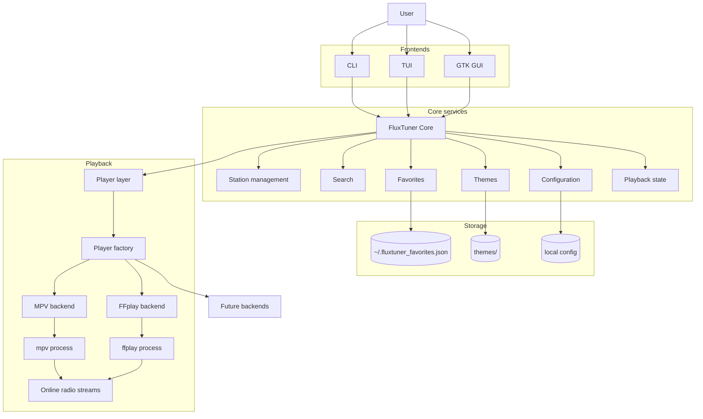

# FluxTuner


A modern internet radio player for the terminal and desktop.

FluxTuner combines:

- a fast keyboard-oriented TUI
- an experimental GTK4 desktop GUI
- smart favorites and playlists
- theming support
- modular playback backends
- lightweight live metadata support

into a lightweight application designed for daily use.

Built with Python and focused on speed, usability and modularity.

---

# Features

## Core Features

- Search internet radio stations by name, genre and country
- Modular playback backend support (`mpv` and `ffplay`)
- Favorites with custom names and tags
- Smart Play by tag or playlist
- Persistent playlists and dynamic tag playlists
- Full theming system with live preview
- Structured table view
- Playback control, with live volume and mute support when the selected backend supports it
- Estimated data usage tracking
- Experimental GTK desktop GUI
- Clean modular architecture
- Live stream metadata display (artist and track when available)

---

# Screenshots

## GTK GUI — Search & Playback


## GTK GUI — Favorites


## GTK GUI — Tag Playlists


## Terminal UI


## Theme Selector


---

# Installation

## Requirements

FluxTuner requires:

- Python 3.11+
- `mpv` or `ffmpeg` / `ffplay`
- A terminal emulator with good Unicode support

The GTK desktop GUI currently requires:

- GTK4
- PyGObject

---

# Install mpv

## CRUX Linux

```bash
sudo prt-get depinst mpv
```

## Debian / Ubuntu

```bash
sudo apt install mpv
```

## Arch Linux

```bash
sudo pacman -S mpv
```

## Fedora

```bash
sudo dnf install mpv
```

## macOS

```bash
brew install mpv
```

---

# Install ffmpeg / ffplay

`ffplay` is included with FFmpeg and can be used as a lightweight fallback backend.

## CRUX Linux

```bash
sudo prt-get depinst ffmpeg
```

## Debian / Ubuntu

```bash
sudo apt install ffmpeg
```

## Arch Linux

```bash
sudo pacman -S ffmpeg
```

## Fedora

```bash
sudo dnf install ffmpeg
```

## macOS

```bash
brew install ffmpeg
```

Verify:

```bash
ffplay -version
```

---

# Running FluxTuner

FluxTuner currently provides two interfaces:

- **TUI (Terminal User Interface)** → fast, lightweight and keyboard-oriented
- **GTK Desktop GUI** → visual desktop experience with playlists, favorites and responsive layout

Both interfaces share the same playback backend, favorites system and playlist data.

---

## Playback Architecture

FluxTuner uses a modular playback backend architecture.

FluxTuner automatically detects the best available playback backend.

Current priority order:

1. `mpv` (recommended)
2. `ffplay` (lightweight fallback)

Backend capability notes:

- `mpv` supports play/stop, live volume and live mute controls.
- `ffplay` is a lightweight fallback focused on play/stop. It does not provide live volume or live mute control in FluxTuner.

Inspect detected playback backends with:

```bash
fluxtuner --list-players
```

or, when running from source:

```bash
python -m fluxtuner --list-players
```

Additional backends may be added in future versions.

---

# Terminal UI (TUI)

The TUI is ideal for:

- SSH sessions
- low-resource systems
- keyboard-driven workflows
- tiling window managers
- fast station browsing

---

## Launch the TUI

### Run directly from source

This is the simplest and least invasive way to test or run FluxTuner from a checkout:

```bash
git clone https://github.com/pitill0/fluxtuner.git
cd fluxtuner

python -m venv .venv
source .venv/bin/activate

pip install -e .

python -m fluxtuner
```

### Run installed command

```bash
fluxtuner
```

Equivalent to:

```bash
python -m fluxtuner
```

### TUI mode

The TUI is the default interface:

```bash
fluxtuner
```

or:

```bash
python -m fluxtuner
```

---

## TUI Features

- Fast search
- Country filtering
- Minimum bitrate filtering
- Favorites support
- Dynamic playlists
- Random playback by tag
- Theme support
- Session data usage tracking
- Modular backend support

---

# GTK Desktop GUI

FluxTuner also includes an experimental GTK4 desktop interface.

The GUI focuses on:

- responsive layout
- playlist workflows
- favorites management
- visual station browsing
- desktop-friendly playback controls
- live metadata display

---

## Launch the GUI

```bash
fluxtuner --gui
```

or:

```bash
python -m fluxtuner --gui
```

---

## GUI Features

- GTK4 desktop interface
- Responsive dark theme
- Fast station search
- Favorites management
- Tag playlist filtering
- Random playback by tag
- Session data usage tracking
- Playback status indicators
- Volume and mute controls when supported by the active backend
- Live artist / track metadata
- Active backend display

---

## Recommended Development / Source Usage

For testing or running FluxTuner without installing it globally:

```bash
git clone https://github.com/pitill0/fluxtuner.git
cd fluxtuner

python -m venv .venv
source .venv/bin/activate

pip install -e .

python -m fluxtuner --player mpv
python -m fluxtuner --gui --player mpv
```

You can also rely on backend autodetection:

```bash
python -m fluxtuner
python -m fluxtuner --gui
```

This workflow is especially useful for development, CRUX Linux and systems where you prefer to avoid global installation.

---

# Install with pipx

Recommended if you want FluxTuner available as a standalone command:

```bash
pipx install git+https://github.com/pitill0/fluxtuner.git
```

Run:

```bash
fluxtuner
```

Install a specific version:

```bash
pipx install git+https://github.com/pitill0/fluxtuner.git@v0.1.0
```

Upgrade:

```bash
pipx upgrade fluxtuner
```

Uninstall:

```bash
pipx uninstall fluxtuner
```

---

# Select Player Backend

FluxTuner currently supports:

- `mpv` (recommended)
- `ffplay` (lightweight fallback backend)

FluxTuner automatically selects the best available backend by default.

Backend capability notes:

- `mpv` supports play/stop, live volume and live mute controls.
- `ffplay` is focused on play/stop and does not provide live volume or live mute control in FluxTuner.

Inspect detected playback backends with:

```bash
fluxtuner --list-players
```

Examples:


```bash
fluxtuner --player auto
```

```bash
fluxtuner --player mpv
```

```bash
fluxtuner --gui --player mpv
```

```bash
fluxtuner --player ffplay
```

```bash
fluxtuner --gui --player ffplay
```

When running from source, use:

```bash
python -m fluxtuner --player mpv
python -m fluxtuner --player ffplay
python -m fluxtuner --gui --player mpv
python -m fluxtuner --gui --player ffplay
```

---

# Themes

List available themes:

```bash
fluxtuner --list-themes
```

Run with a theme:

```bash
fluxtuner --theme nord
```

Save a theme as default:

```bash
fluxtuner --theme nord --save-theme
```

or:

```bash
fluxtuner --save-theme nord
```

---

# Useful Commands

```bash
# Show help
fluxtuner --help

# Show version
fluxtuner --version

# List available playback backends
fluxtuner --list-players

# Run the legacy numbered CLI
fluxtuner --cli

# Clear search cache
fluxtuner --clear-cache

# Export favorites
fluxtuner --export-favs favorites.json

# Import favorites
fluxtuner --import-favs favorites.json

# Export playlists
fluxtuner --export-playlists playlists.json

# Import playlists
fluxtuner --import-playlists playlists.json
```

When running from source, replace `fluxtuner` with:

```bash
python -m fluxtuner
```

---

## Development checks

Run the standard local quality checks:

```bash
ruff check .
ruff format --check .
python -m compileall fluxtuner tests
python -m pytest
```

Audit installed Python dependencies:

```bash
python -m pip install pip-audit
pip-audit --local
```

---

# macOS GTK Development Note

When using a Python virtual environment, PyGObject installed via Homebrew may not be visible inside the venv.

Install dependencies:

```bash
brew install gtk4 pygobject3 mpv ffmpeg
```

If your shell aliases `python` to a system interpreter, the virtual environment may be bypassed.

Check:

```bash
which python
```

If needed:

```bash
unalias python
```

If the GUI fails with:

```text
ModuleNotFoundError: No module named 'gi'
```

run FluxTuner with Homebrew's PyGObject path:

```bash
PYGOBJECT_SITE_PACKAGES="$(dirname "$(find "$(brew --prefix)" -path "*/site-packages/gi/__init__.py" 2>/dev/null | head -n 1)")"
PYTHONPATH="$PYGOBJECT_SITE_PACKAGES" python -m fluxtuner --gui --player mpv
```

On Apple Silicon this often resolves to:

```bash
PYTHONPATH=/opt/homebrew/lib/python3.14/site-packages \
python -m fluxtuner --gui --player mpv
```

Find the correct path with:

```bash
find "$(brew --prefix)" -path "*site-packages/gi/__init__.py" 2>/dev/null
```

---

# Keybindings

| Key     | Action                                                   |
| ------- | -------------------------------------------------------- |
| `/`     | Focus search                                             |
| `Enter` | Play selected station                                    |
| `x`     | Stop playback                                            |
| `Space` | Play / Stop selected station                             |
| `+ / -` | Volume up / down when supported by the active backend    |
| `m`     | Mute / unmute when supported by the active backend       |
| `a`     | Add to favorites                                         |
| `f`     | Open favorites                                           |
| `d`     | Remove favorite                                          |
| `e`     | Edit favorite name                                       |
| `g`     | Edit favorite tags                                       |
| `p`     | Open playlists                                           |
| `n`     | New playlist                                             |
| `b`     | Add to playlist                                          |
| `t`     | Filter by tag / open theme selector depending on context |
| `h`     | History                                                  |
| `l`     | Play last station                                        |
| `q`     | Quit                                                     |

---

# Built-in Themes

Built-in themes:

- default
- nord
- dracula
- amber
- ptmtrx

Features:

- Live preview in selector
- Apply with `Enter`
- Save with `y`

---

# Data Storage

FluxTuner stores new user data in XDG-style locations.

These base directories respect `XDG_CONFIG_HOME`, `XDG_DATA_HOME` and `XDG_CACHE_HOME` when they are set, which also makes the same layout suitable for sandboxed environments such as Flatpak.

- Config: `~/.config/fluxtuner/config.json`
- Favorites: `~/.local/share/fluxtuner/favorites.json`
- Playlists: `~/.local/share/fluxtuner/playlists.json`
- History: `~/.local/share/fluxtuner/history.json`
- Data usage: `~/.local/share/fluxtuner/usage.json`
- Search cache: `~/.cache/fluxtuner/search_cache.json`

Legacy files such as `~/.fluxtuner_favorites.json`, `~/.fluxtuner_playlists.json`, `~/.fluxtuner_history.json` and `~/.fluxtuner_usage.json` are copied into the new location when needed and kept in place as a conservative migration.

---

## Architecture



---

# Roadmap

## Current Development Focus

- Improved GTK desktop experience
- Better playlist workflows
- Responsive layouts
- Packaging and distribution
- Persistent GUI settings
- Live stream metadata improvements

## Planned

- MPRIS/media key support
- Improved backend capability reporting
- More advanced station history views
- Import/export improvements
- Flatpak packaging
- AppImage builds
- Mobile-oriented interface experiments

---

# Contributing

PRs are welcome.

Issues, feature requests and feedback are always appreciated.

---

# Commercial Use

FluxTuner is open source and available under the MIT license.

You are free to use, modify, and distribute it, including for commercial purposes.

That said, if you plan to integrate FluxTuner into a commercial product, service, or distribution, please consider reaching out.

Contributions, attribution, or collaboration are always appreciated.

---

# License

MIT

---

# Support the Project

If you find FluxTuner useful:

- Star the repository
- Report issues
- Suggest improvements
- Share screenshots or workflows

Your support helps shape the future of the project.
