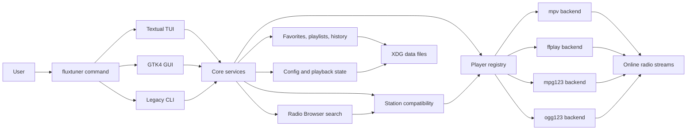

# FluxTuner


**Website:** [https://fluxtuner.vjml.es](https://fluxtuner.vjml.es)

FluxTuner is a modern internet radio player for the terminal and desktop.

It combines a fast keyboard-oriented Textual TUI, a GTK4 desktop GUI, smart favorites and playlists, theming, live metadata, data usage tracking and modular playback backends.


---

## Highlights

- Search internet radio stations by name, genre/tag and country.
- Play streams through `mpv`, `ffplay`, `mpg123` or `ogg123` with automatic backend detection.
- Manage favorites, custom favorite names, tags and playlists.
- Use dynamic tag playlists, random playback and station history.
- Switch built-in TUI themes with live preview.
- Run either the default Textual TUI, the GTK4 desktop GUI or the legacy numbered CLI.
- Store user data in XDG-style config, data and cache locations.

---

## Screenshots

### GTK GUI


### Terminal UI


---

## Quick start

### Requirements

- Python 3.11+
- `mpv` recommended, `ffmpeg` / `ffplay` as broad fallback, or optional lightweight `mpg123` / `ogg123` backends
- Optional GUI dependencies: GTK4 and PyGObject

### Run from source

```bash
git clone https://github.com/pitill0/fluxtuner.git
cd fluxtuner

python -m venv .venv
source .venv/bin/activate
python -m pip install -e .

python -m fluxtuner
```

### Install with pipx

```bash
pipx install git+https://github.com/pitill0/fluxtuner.git
fluxtuner
```

### Launch modes

```bash
fluxtuner              # default Textual TUI
fluxtuner --gui        # GTK4 desktop GUI
fluxtuner --cli        # legacy numbered CLI
```

---

## Common commands

```bash
fluxtuner --help
fluxtuner --version
fluxtuner --list-players
fluxtuner --doctor
fluxtuner --list-themes
fluxtuner --theme nord
fluxtuner --theme nord --save-theme
fluxtuner --export-favs favorites.json
fluxtuner --import-favs favorites.json
fluxtuner --export-playlists playlists.json
fluxtuner --import-playlists playlists.json
fluxtuner --clear-cache
```

---

## Documentation

| Topic | Link |
| --- | --- |
| Project website, overview, screenshots and quick introduction | [FluxTuner website](https://fluxtuner.vjml.es) |
| Installation, launch modes, player backends, themes, keybindings and data storage | [Usage guide](docs/usage.md) |
| Architecture, modules, storage and playback flow | [Architecture](docs/architecture.md) |
| Local development, tests, quality checks and troubleshooting | [Development guide](docs/development.md) |
| Release process | [Release guide](docs/release.md) |
| Flatpak packaging notes | [Flatpak guide](flatpak/README.md) |
| Security policy | [Security](SECURITY.md) |
| Changes by version | [Changelog](CHANGELOG.md) |
| Contributing workflow | [Contributing](CONTRIBUTING.md) |

---

## Architecture at a glance



See the full design notes in [docs/architecture.md](docs/architecture.md).

---

## Current focus

FluxTuner is under active development. The current focus is to keep improving the stable TUI and GTK desktop GUI, refine playlist and favorites workflows, improve packaging/distribution paths, and continue hardening reliability, tests and documentation.

The roadmap is intentionally kept out of the README until items are confirmed. Please use GitHub issues and discussions for proposed features, bugs and packaging requests.

---

## Contributing

Issues, feature requests, screenshots, workflows and pull requests are welcome.

A good first contribution can be as simple as:

- trying FluxTuner on your Linux/macOS setup,
- reporting whether `mpv`, `ffplay`, `mpg123` or `ogg123` detection works,
- sharing terminal or GTK screenshots,
- suggesting stations, playlist workflows or packaging improvements,
- opening a small documentation or bug-fix PR.

See [CONTRIBUTING.md](CONTRIBUTING.md) and [docs/development.md](docs/development.md).

---

## Commercial use

FluxTuner is open source and available under the MIT license.

You are free to use, modify and distribute it, including for commercial purposes. If you plan to integrate FluxTuner into a commercial product, service or distribution, collaboration, attribution or feedback would be appreciated.

---

## License

MIT

---

## Support the project

If you find FluxTuner useful, please consider starring the repository, opening issues, suggesting improvements or sharing your setup. Feedback helps shape the future of the project.
