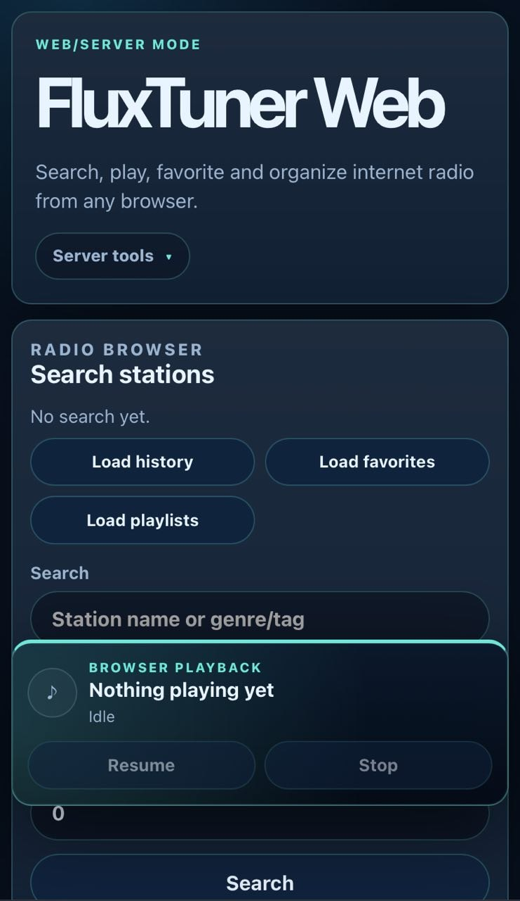

# FluxTuner


**Website:** [https://fluxtuner.vjml.es](https://fluxtuner.vjml.es)

FluxTuner is an internet radio platform for terminal, desktop and self-hosted web.

It combines a fast keyboard-oriented Textual TUI, a GTK4 desktop GUI and a browser-based Web/server platform with multi-user support, administration tools, favorites, playlists, live metadata, data usage tracking and modular playback backends.

Run the Web/server mode on your own infrastructure and keep accounts, favorites, playlists and listening history under your control. FluxTuner does not add platform tracking or platform-injected advertising; station discovery and playback still rely on external catalog and stream providers.

## Contents

- [Highlights](#highlights)
- [Self-hosted Web platform](#self-hosted-web-platform)
- [Screenshots](#screenshots)
- [Quick start](#quick-start)
- [Launch modes](#launch-modes)
- [Web/server mode](#webserver-mode)
- [Common commands](#common-commands)
- [Documentation](#documentation)
- [Licensing](#licensing)
- [Support the project](#support-the-project)

---

## Highlights

- Search internet radio stations by name, genre/tag and country.
- Play streams through `mpv`, `ffplay`, `mpg123` or `ogg123` with automatic backend detection.
- Manage favorites, custom favorite names, tags and playlists.
- Use dynamic tag playlists, random playback and station history.
- Switch built-in TUI themes with live preview.
- Run the default Textual TUI, GTK4 desktop GUI, legacy numbered CLI or browser-based web/server mode.
- Use Web/server accounts with first-run admin setup, pending account requests, authenticated profiles, CSRF-protected mutations, dashboard metrics and admin user management.
- Store library data in a local SQLite database, with XDG-style config, data and cache locations.

---

## Self-hosted Web platform

FluxTuner can be deployed as a private, non-commercial Web platform for individuals, families and trusted groups.

The Web/server mode includes:

- Multi-user accounts.
- Registration requests with administrator approval.
- Private favorites, playlists and listening history.
- User and session administration.
- Dashboard metrics.
- A responsive browser interface.
- Persistent SQLite storage.
- Docker- and Podman-friendly deployment.

Run FluxTuner on your own server and access your radio library from any modern browser. See [`docs/secure-web-deployment.md`](docs/secure-web-deployment.md) before exposing an instance to a LAN or the internet.

---

## Screenshots

### Web mode

<p align="center">
  
</p>

### GTK GUI


### Terminal UI


---

## Quick start

### Requirements

- Python 3.11+
- `mpv` recommended, `ffmpeg` / `ffplay` as broad fallback, or optional lightweight `mpg123` / `ogg123` backends
- Optional GUI dependencies: GTK4 and PyGObject

### Run the Web platform with Docker Compose

From the repository root:

```bash
docker compose up --build -d
```

Then open:

```text
http://127.0.0.1:8080
```

This Compose setup is intended as a convenient starting point. Before exposing FluxTuner to a LAN or the internet, review [`docs/container.md`](docs/container.md) and [`docs/secure-web-deployment.md`](docs/secure-web-deployment.md) for persistent storage, setup-token, HTTPS, secure-cookie and reverse-proxy requirements.

### Run from source

```bash
git clone https://github.com/pitill0/fluxtuner.git
cd fluxtuner

python -m venv .venv
source .venv/bin/activate
python -m pip install -e .

python -m fluxtuner
```

### Install with pipx

```bash
pipx install git+https://github.com/pitill0/fluxtuner.git
fluxtuner
```

### Run from a tagged source archive

Choose a release tag from the GitHub Releases page, then download and extract
that version. For example:

Set `VERSION` to the release you want to run:

```bash
VERSION=X.Y.Z
wget "https://github.com/pitill0/fluxtuner/archive/refs/tags/v${VERSION}.tar.gz"
tar xvf "v${VERSION}.tar.gz"
cd "fluxtuner-${VERSION}"
```

Install the Python dependencies required by the terminal interface.

For pip-based environments:

    python -m pip install requests rich textual

On systems using distribution packages, install the equivalent packages instead, for example:

    requests
    rich
    textual

Then launch FluxTuner:

    python -m fluxtuner

For playback, make sure at least one supported player backend is installed:

    mpv
    ffplay
    mpg123
    ogg123

`mpv` is recommended for the best general compatibility.

#### GTK GUI dependencies

To run the GTK interface, you also need GTK 4 and PyGObject available on your system.

For pip-based environments, PyGObject may still require system GTK development/runtime packages, so distribution packages are often preferred.

On Debian/Ubuntu-based systems:

    sudo apt install python3-gi gir1.2-gtk-4.0

On Arch Linux:

    sudo pacman -S gtk4 python-gobject

On systems using source-based or ports-based package managers, install the equivalent packages for:

    GTK 4
    PyGObject
    GObject Introspection

Then launch the GUI mode using the documented FluxTuner GUI option.

This method is useful for testing a release quickly. For regular use, prefer the packaged installation methods when available.

### Launch modes

```bash
fluxtuner              # default Textual TUI
fluxtuner --gui        # GTK4 desktop GUI
fluxtuner --cli        # legacy numbered CLI
```

### Web/server mode

FluxTuner includes a browser-based web/server mode with local accounts, pending account requests, an authenticated dashboard, first-run administrator setup, private library APIs and browser playback:

```bash
python -m pip install -e ".[web]"
fluxtuner-web --host 127.0.0.1 --port 8080
```

Open it in your browser:

```text
http://127.0.0.1:8080
```

For isolated web development, testing, or containers, set a custom data directory:

```bash
FLUXTUNER_DATA_DIR=/tmp/fluxtuner-web-dev fluxtuner-web --host 127.0.0.1 --port 8080
```

This keeps web playback history, favorites and playlists separate from your regular FluxTuner data directory. After the first administrator is configured, new users can request access from the login screen. Requests stay pending until an administrator approves or rejects them; FluxTuner does not send email notifications, so users should try signing in later to check their status.

FluxTuner treats favorites as the saved station library. Manual playlists store
references to saved stations, so adding a station to a playlist also saves it to
the user's favorites/library when needed. This keeps playlist export/import,
random playback and station metadata resolution consistent across the TUI, GTK,
CLI and Web interfaces.

See [`docs/web.md`](docs/web.md) for Web/server usage, [`docs/container.md`](docs/container.md) for containers, and [`docs/secure-web-deployment.md`](docs/secure-web-deployment.md) for network-accessible deployments.

---


## Common commands

Use the installed `fluxtuner` command for normal use:

```bash
fluxtuner --help
fluxtuner --version
fluxtuner --list-players
fluxtuner --list-profiles
fluxtuner --profile work --set-active-profile
fluxtuner --show-active-profile
fluxtuner --clear-active-profile
fluxtuner --profile work --export-favs work-favorites.json
fluxtuner --profile work --import-favs work-favorites.json
fluxtuner --profile work --export-playlists work-playlists.json
fluxtuner --profile work --import-playlists work-playlists.json
fluxtuner --cli --profile work
```

When working directly from a source checkout, the equivalent form is
`python -m fluxtuner ...`.

`--profile NAME` targets a named profile for profile-aware commands. When omitted,
FluxTuner uses the persisted active profile if one is configured, otherwise it
uses the internal `default` profile.

Profile resolution order is:

1. Explicit `--profile NAME`
2. Persisted active profile
3. Internal default profile

The persisted active profile is used by CLI import/export commands, the legacy
numbered CLI favorites flow, the Textual TUI, GTK GUI and Web mode.

Web API endpoints additionally accept `?profile=NAME` as a per-request override,
for example:

    /api/favorites?profile=work

Profiles separate favorites, manual playlists and playback history by context.
They are not separate user accounts in local CLI/TUI/GTK mode. Web/server mode adds authenticated users that own their own profiles.

## Documentation

- [Usage guide](docs/usage.md)
- [Architecture](docs/architecture.md)
- [Web/server mode](docs/web.md)
- [Web multi-user model](docs/multiuser.md)
- [Secure web deployment](docs/secure-web-deployment.md)
- [Container usage](docs/container.md)
- [Release process](docs/release.md)
- [Licensing details](docs/licensing.md)
- [Smoke test](SMOKE_TEST.md)
- [Contributing](CONTRIBUTING.md)
- [Engineering process](docs/ENGINEERING-PROCESS.md)
- [Security policy](SECURITY.md)

---

## Licensing

FluxTuner uses a split licensing model:

- **MIT License** for the local/core platform components.
- **FluxTuner Web Non-Commercial License** for Web/server, multi-user,
  authentication, session, first-run setup, admin-user management, and hosted
  service components.

Private, non-commercial self-hosting is permitted under the Web license.
Commercial Web/server deployments, SaaS offerings, managed hosting and other
commercial uses require a separate written commercial license.
For commercial licensing enquiries, contact the project author through the 
repository or the project website.

The FluxTuner name, logo, icons, screenshots, project website identity, and
branding are not licensed with the software.

See:

- [`LICENSE`](LICENSE)
- [`LICENSE-WEB`](LICENSE-WEB)
- [`TRADEMARKS.md`](TRADEMARKS.md)
- [`docs/licensing.md`](docs/licensing.md)

---

## Support the project

If you find FluxTuner useful, please consider starring the repository, opening issues, suggesting improvements or sharing your setup. Feedback helps shape the future of the project.
