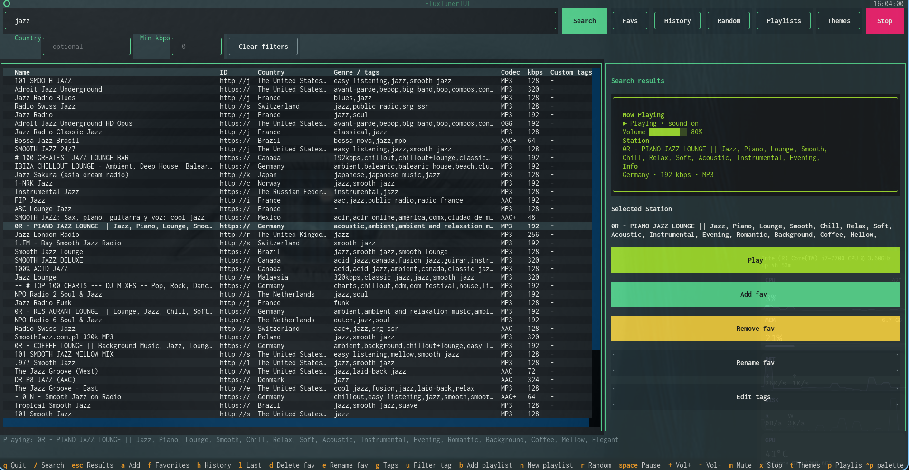
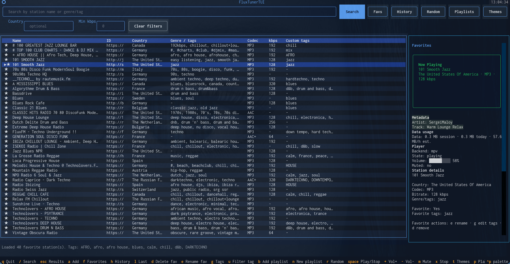

# 🎧 FluxTuner


A modern terminal-based internet radio player with powerful search, playlists, theming, and a clean TUI.

Built with Python, powered by mpv, and designed for daily use.

---

## ✨ Features

* 🔎 Search internet radio stations (name, genre, country)
* ▶️ Play streams with mpv (fast & lightweight)
* ⭐ Favorites with custom names and tags
* 🧠 Smart Play (random by tag or playlist)
* 📂 Persistent playlists + dynamic tag playlists
* 🎨 Full theming system with live preview
* 📊 Structured table view (clean and readable)
* 🎛️ Volume, mute and playback control
* 🧩 Clean modular architecture

---

## 📸 Screenshots

### 🔎 Search & Playback



### ⭐ Favorites & Playlists



### 🎨 Theme Selector


---

## 🚀 Installation

### Requirements

* Python 3.10+
* mpv

#### Install mpv

```bash
# Debian / Ubuntu
sudo apt install mpv

# Arch
sudo pacman -S mpv

# macOS
brew install mpv
```

---

### Install with pipx (recommended)

```bash
pipx install .
fluxtuner
```

---

### Development install

```bash
git clone https://github.com/pitill0/fluxtuner.git
cd fluxtuner
pip install -e .
```

---

## ⌨️ Keybindings

| Key     | Action                |
| ------- | --------------------- |
| `/`     | Focus search          |
| `Enter` | Play selected station |
| `x`     | Stop playback         |
| `Space` | Pause / Resume        |
| `+ / -` | Volume up / down      |
| `m`     | Mute                  |
| `a`     | Add to favorites      |
| `f`     | Open favorites        |
| `d`     | Remove favorite       |
| `e`     | Edit favorite name    |
| `g`     | Edit favorite tags    |
| `p`     | Open playlists        |
| `n`     | New playlist          |
| `b`     | Add to playlist       |
| `t`     | Filter by tag         |
| `h`     | History               |
| `l`     | Play last station     |
| `q`     | Quit                  |

---

## 🎨 Themes

* Built-in themes: default, nord, dracula, amber, ptmtrx
* Live preview in selector
* Apply with `Enter`
* Save with `y`

---

## 📁 Data storage

* Favorites: `~/.fluxtuner_favorites.json`
* Playlists: `~/.fluxtuner_playlists.json`
* Config: `~/.config/fluxtuner/config.json`

---

## 🤝 Contributing

PRs are welcome.

---

## 📄 License

MIT

