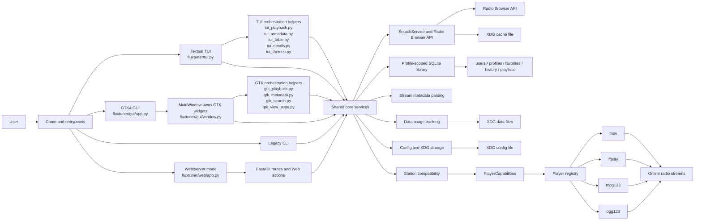
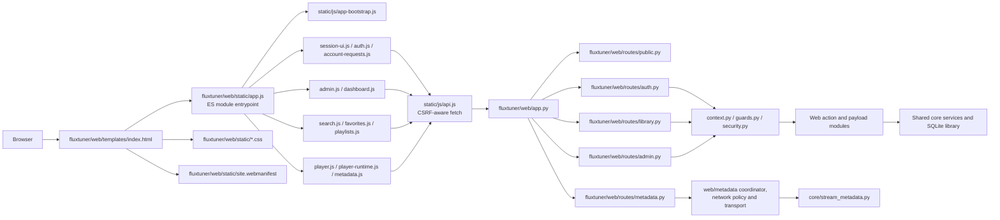
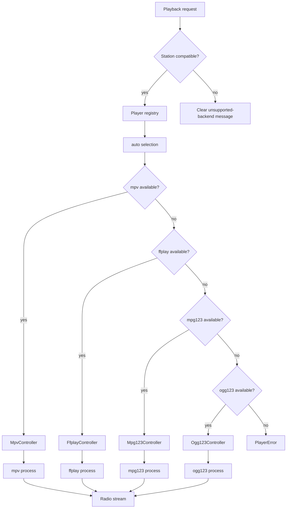

# Architecture

## SQLite library database

The primary local library store is SQLite:

    ~/.local/share/fluxtuner/fluxtuner.db

The database stores normalized stations, profiles, favorites, playback history
and manual playlists.

FluxTuner local interfaces use profile-scoped library data. Profiles are
context-level separation inside the same FluxTuner installation. They are useful for contexts
such as work, home, terrace, pool, focus or testing.

Current model:

    FluxTuner installation
    ├── config.json
    │   └── active_profile: optional profile name
    └── SQLite library database
        └── profiles
            ├── default
            │   ├── favorites
            │   ├── playback history
            │   └── manual playlists
            ├── work
            │   ├── favorites
            │   ├── playback history
            │   └── manual playlists
            └── terrace
                ├── favorites
                ├── playback history
                └── manual playlists

Profile resolution order:

    1. Explicit profile, for example CLI --profile NAME or Web ?profile=NAME inside the current user
    2. Persisted active profile from config
    3. Internal default profile

Profiles are not user accounts in local CLI/TUI/GTK mode. Web/server mode adds
authenticated users above profiles, so each Web user owns their own profile set.

The Web user/account model adds ownership above profiles:

    user
    └── profile
        ├── favorites
        ├── playback history
        └── manual playlists

FluxTuner is organized as a multi-interface platform with frontends that share core services, user data and playback backends.

For completed refactor milestones and larger internal cleanup plans, see [`docs/refactor-roadmap.md`](refactor-roadmap.md).

## Overview




## Web/server architecture

FluxTuner Web keeps the server and browser client deliberately simple: FastAPI
serves the HTML shell, static assets and JSON API routes, while the browser loads
a small ES module entrypoint that composes focused controllers.



This no-build JavaScript structure keeps the deployed Web UI inspectable while
avoiding one large browser script. New Web client behavior should be added to a
focused module under `fluxtuner/web/static/js/` and wired from `static/app.js`.


## Interface orchestration boundaries

The refactor keeps toolkit ownership inside each frontend while extracting
small, testable orchestration components.

### Textual TUI

`fluxtuner/tui.py` owns the Textual application, widgets, event handlers and
screen-level state. It delegates focused behavior to:

- `fluxtuner/tui_playback.py` for playback start/stop coordination;
- `fluxtuner/tui_metadata.py` for metadata lifecycle and projection state;
- `fluxtuner/tui_table.py` for table construction and row-key handling;
- `fluxtuner/tui_details.py` for detail-panel projection text;
- `fluxtuner/tui_themes.py` for theme-related status messages.

These helpers do not own Textual widgets or the application lifecycle.

### GTK GUI

`fluxtuner/gui/window.py` owns `MainWindow`, GTK widgets, signal handlers,
selection and rendered view state. It delegates focused behavior to:

- `fluxtuner/gui/gtk_playback.py` for playback coordination contracts;
- `fluxtuner/gui/gtk_metadata.py` for metadata lifecycle and projection;
- `fluxtuner/gui/gtk_search.py` for stale-search suppression;
- `fluxtuner/gui/gtk_view_state.py` for logical view transitions.

The extracted helpers remain independent of GTK widget construction. GTK
updates and lifecycle decisions stay in `MainWindow`, including applying
worker results on the GLib main context. Window shutdown stops active timers,
metadata polling, usage tracking and player playback.

### Web/server mode

The Web interface separates browser controllers, FastAPI route adapters,
guards/security, action modules and shared core services. Stream metadata uses
an additional protected pipeline under `fluxtuner/web/metadata/` for URL
normalization, address policy, redirect handling, transport and bounded
coordination.

## Frontends

FluxTuner currently has four user-facing modes:

- Textual TUI, the default interface.
- GTK4 desktop GUI.
- Legacy numbered CLI.
- Browser-based Web/server mode.

All frontends should use shared core modules instead of duplicating station, favorite, playlist, storage or playback logic.

## Entrypoint

`fluxtuner.__main__` parses command-line options and dispatches to the selected interface:

- `fluxtuner` starts the Textual TUI.
- `fluxtuner --gui` starts the GTK4 desktop GUI.
- `fluxtuner --cli` starts the legacy numbered CLI.
- `fluxtuner-web` starts the browser-based Web/server mode.

It also handles utility commands such as:

- `--list-players`
- `--doctor`
- `--list-themes`
- `--clear-cache`
- `--export-favs`
- `--import-favs`
- `--export-playlists`
- `--import-playlists`

## Core services

The `fluxtuner/core/` package contains reusable behavior shared across interfaces.

Important areas:

```text
fluxtuner/core/
  api.py                   Radio Browser API integration and diagnostics
  cache.py                 Search cache
  compatibility.py         Station/backend compatibility helpers
  data_usage.py            Playback data usage tracking
  db.py                    SQLite connection, schema and compatibility facade
  favorites.py             Favorites persistence, migration and updates
  history.py               Playback history persistence and migration
  importers.py             Import validation for favorites/playlists
  manual_playlists.py      User-managed playlist service
  password_changes.py      Password-change request persistence
  playlists.py             Tag playlists and playlist persistence helpers
  profiles.py              Profile persistence and effective-profile resolution
  public_stats.py          Public activity statistics
  search_service.py        Shared station search service
  stations.py              Station normalization and persistence helpers
  storage.py               Atomic JSON writes for remaining JSON files
  stream_metadata.py       ICY stream metadata parsing
  users.py                 Web user persistence
```

## Search flow

Both the TUI and GTK GUI use the shared `SearchService`.

The search flow is:

1. Frontend builds a search request from user input.
2. `SearchService` handles query parameters and cache behavior.
3. Radio Browser API integration retrieves station data.
4. Station helpers normalize returned station dictionaries.
5. If the active backend is specialized, compatibility helpers filter unsupported stations where possible.
6. Frontend renders results and delegates playback to the selected backend.

## Playback layer

Playback is implemented through a backend registry.



Current backends:

- `mpv` — recommended general-purpose backend with richer live controls.
- `ffplay` — general-purpose fallback focused on simple playback.
- `mpg123` — lightweight specialized backend for MP3/MPEG streams.
- `ogg123` — lightweight specialized backend for Ogg/Vorbis/Opus/FLAC-style streams, depending on the local `ogg123` build.

`mpv` and `ffplay` are treated as broadly compatible backends. `mpg123` and `ogg123` are specialized backends, so FluxTuner uses declared `PlayerCapabilities` plus station metadata to filter unsupported stations where possible.

## Player capabilities and station compatibility

Each backend declares static capabilities through `PlayerCapabilities`.

The compatibility layer lives in `fluxtuner/core/compatibility.py` and is used by `SearchService` and the frontends to avoid starting streams that are unlikely to work with the active backend.

The intended behavior is:

- Search results are filtered when the active backend is specialized.
- Favorites, history and playlists are kept intact.
- Incompatible saved stations can be marked in the UI instead of being deleted.
- Random playback and smart playlist playback should only choose compatible stations.
- Attempting to play an incompatible station shows a clear message suggesting `mpv` or `ffplay` for broader compatibility.

## Storage

FluxTuner uses XDG-style paths through `fluxtuner.paths`.

The primary local library store is SQLite:

```text
~/.local/share/fluxtuner/fluxtuner.db
```

The SQLite database stores the profile-scoped library:

- normalized stations
- favorites
- playback history
- manual playlists

Favorites are the canonical saved-station library. Manual playlists store station
references and resolve them through the saved station/favorites model rather than
owning an independent station copy. As a consequence, adding a station to a
manual playlist may also save it to favorites/library when needed. This is an
intentional compatibility choice for `1.0.0`, not an accidental Web-only side
effect.

FluxTuner stores favorites, playback history and manual playlists under an
internal profile. The default profile is named `default`.

Core library APIs can resolve an optional `profile_id` or `profile_name`. When no
explicit profile is provided, app interfaces use the persisted active profile if
one is configured, otherwise they fall back to the internal `default` profile.

Profiles are context-level separation in local CLI/TUI/GTK mode. In Web mode,
profiles are owned by authenticated Web users and must be resolved through the
current server-side session.

Other local files remain JSON-based:

```text
~/.config/fluxtuner/config.json
~/.local/share/fluxtuner/usage.json
~/.cache/fluxtuner/search_cache.json
```

These paths respect:

- `XDG_CONFIG_HOME`
- `XDG_DATA_HOME`
- `XDG_CACHE_HOME`

`FLUXTUNER_DATA_DIR` overrides the data directory used for `fluxtuner.db`,
`usage.json` and migration source files. It does not override config or cache
locations.

Legacy library files are migrated conservatively:

```text
~/.local/share/fluxtuner/favorites.json
~/.local/share/fluxtuner/playlists.json
~/.local/share/fluxtuner/history.json
```

Older dotfiles such as `~/.fluxtuner_favorites.json`,
`~/.fluxtuner_playlists.json` and `~/.fluxtuner_history.json` are copied into
the current XDG data directory when needed. The JSON files are then imported into
SQLite once and kept in place instead of being deleted.

Import and export commands still use JSON as the external interchange format.

Local JSON writes should use atomic persistence helpers where possible.

## Themes

TUI themes are stored as bundled TCSS files under `fluxtuner/themes/`.

The TUI loads the selected theme on startup and supports runtime preview/application for a practical subset of theme declarations.

## Security-sensitive areas

Security-sensitive areas include:

- Player executable resolution.
- Stream URL validation.
- Station/backend compatibility checks.
- External player subprocess execution.
- Imported JSON validation.
- Local user data writes.
- Network/API error handling.
- ICY stream metadata parsing.

See `SECURITY.md` and `docs/development.md` for validation and contribution guidance.

## Web multi-user model

FluxTuner implements real multi-user behavior for Web/server mode only.
CLI, TUI and GTK GUI remain local interfaces that use the local filesystem
trust model.

The web model adds authenticated users above profiles:

    authenticated web user
    └── owned profile
        ├── favorites
        ├── playback history
        └── manual playlists

Web API requests resolve the current user from the authenticated session.
Profile overrides such as `?profile=work` must only select profiles owned by
that authenticated user.

Public account requests are created as pending/inactive users and must be
approved by an administrator before login succeeds. The Web dashboard shows
per-user library metrics to normal users and additional aggregate user/server
metrics to administrators.

See `docs/multiuser.md` for the detailed Web account, profile ownership and pending-account model.
