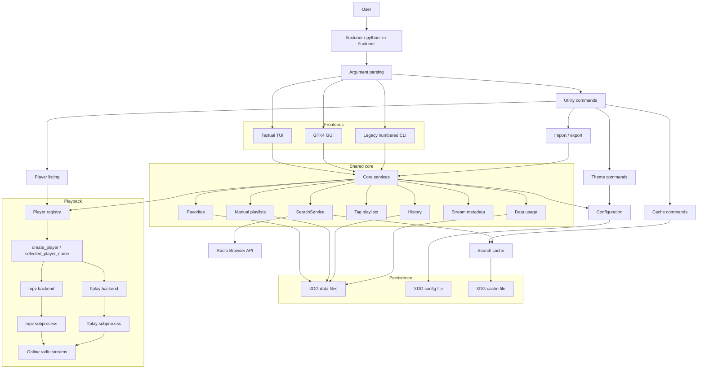

# Architecture

FluxTuner is organized around three frontends, shared core services, local persistence helpers and a small playback backend layer.

The current frontends are:

- Textual TUI, launched by default.
- GTK4 desktop GUI, launched with `--gui`.
- Legacy numbered CLI, launched with `--cli`.

All frontends use the same station search, favorites, playlist, history, configuration and player backend services.

## High-level architecture



## Entrypoint flow

`fluxtuner.__main__` owns command-line parsing and dispatches to the requested mode.

Main responsibilities:

- Parse flags such as `--gui`, `--cli`, `--player`, `--theme`, `--list-players`, `--list-themes`, import/export and cache commands.
- Resolve the selected player backend.
- Load or save theme configuration.
- Dispatch to the default Textual TUI, GTK GUI or legacy CLI.

## Frontends

### Textual TUI

The Textual TUI is the default interface. It handles search, filters, favorites, playlists, themes, playback controls, metadata display, history and session data usage in a keyboard-oriented layout.

### GTK4 GUI

The GTK4 GUI is the desktop-oriented interface. It shares the same backend services as the TUI while exposing a visual station list, side panel, playback bar, favorites, playlists, metadata and data usage display.

### Legacy CLI

The legacy CLI is a simple numbered interface kept as a lightweight fallback and diagnostic mode.

## Shared core services

The `fluxtuner/core/` package contains reusable logic used by the frontends:

```text
fluxtuner/core/
  api.py                   Radio Browser API integration
  cache.py                 Search cache
  data_usage.py            Playback data usage tracking
  favorites.py             Favorites persistence and updates
  history.py               Playback history
  importers.py             Import validation for favorites/playlists
  manual_playlists.py      User-managed playlists
  playlists.py             Tag/dynamic playlist helpers
  search_service.py        Shared station search service
  stations.py              Station normalization helpers
  storage.py               Atomic JSON writes
  stream_metadata.py       ICY stream metadata parsing
```

## Playback layer

Playback is isolated behind a small adapter layer in `fluxtuner/players/`.

```text
fluxtuner/players/
  base.py      Player interface and shared errors
  mpv.py       mpv backend
  ffplay.py    ffplay backend
  security.py  Executable and stream URL validation
```

Supported backends are registered in `PLAYER_BACKENDS`:

1. `mpv`
2. `ffplay`

`selected_player_name("auto")` returns the first available backend in registry order. `create_player()` then instantiates the selected backend.

Backend capability summary:

| Backend | Play/stop | Live volume | Live mute | Notes |
| --- | --- | --- | --- | --- |
| `mpv` | Yes | Yes | Yes | Recommended backend. |
| `ffplay` | Yes | No | No | Lightweight fallback through FFmpeg. |

## Persistence

FluxTuner uses XDG-style paths through `fluxtuner.paths`.

Default locations:

```text
~/.config/fluxtuner/config.json
~/.local/share/fluxtuner/favorites.json
~/.local/share/fluxtuner/playlists.json
~/.local/share/fluxtuner/history.json
~/.local/share/fluxtuner/usage.json
~/.cache/fluxtuner/search_cache.json
```

The path helpers respect:

- `XDG_CONFIG_HOME`
- `XDG_DATA_HOME`
- `XDG_CACHE_HOME`

Legacy dotfiles are copied into the new XDG locations when needed and kept in place as a conservative migration.

## Search and metadata

Station search goes through the shared search service and Radio Browser integration. Results are normalized before being displayed by the TUI, GUI or CLI.

Stream metadata support reads ICY metadata when available. Metadata is intentionally lightweight and bounded so playback and UI responsiveness remain the priority.

## Documentation split

The README should remain a landing page. Detailed information should live in focused documents:

- `README.md`: overview, quick start, screenshots, short command list and links.
- `docs/usage.md`: user-facing installation, launch modes, backends, themes, keybindings and storage.
- `docs/architecture.md`: architecture and diagram.
- `docs/development.md`: local development, validation commands, tests, logging, security and troubleshooting.
- `docs/release.md`: release process.
- `flatpak/README.md`: Flatpak packaging notes.
