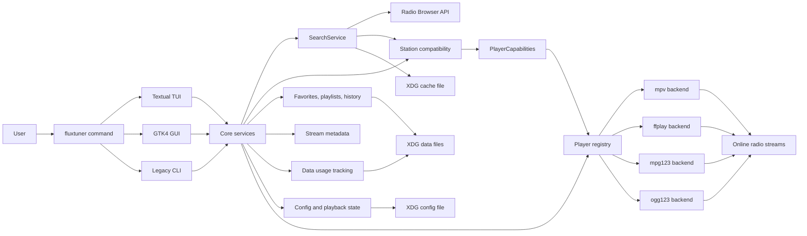
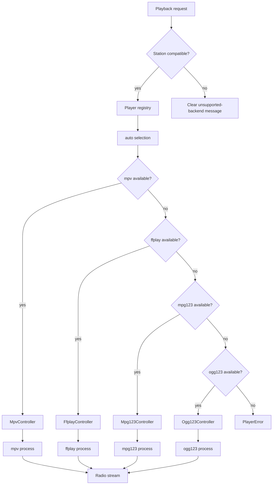

# Architecture

FluxTuner is organized around a small set of frontends that share core services, user data and playback backends.

## Overview



## Frontends

FluxTuner currently has three launch modes:

- Textual TUI, the default interface.
- GTK4 desktop GUI.
- Legacy numbered CLI.

All frontends should use shared core modules instead of duplicating station, favorite, playlist, storage or playback logic.

## Entrypoint

`fluxtuner.__main__` parses command-line options and dispatches to the selected interface:

- `fluxtuner` starts the Textual TUI.
- `fluxtuner --gui` starts the GTK4 desktop GUI.
- `fluxtuner --cli` starts the legacy numbered CLI.

It also handles utility commands such as:

- `--list-players`
- `--doctor`
- `--list-themes`
- `--clear-cache`
- `--export-favs`
- `--import-favs`
- `--export-playlists`
- `--import-playlists`

## Core services

The `fluxtuner/core/` package contains reusable behavior shared across interfaces.

Important areas:

```text
fluxtuner/core/
  api.py                   Radio Browser API integration
  cache.py                 Search cache
  data_usage.py            Playback data usage tracking
  favorites.py             Favorites persistence and updates
  history.py               Playback history
  importers.py             Import validation for favorites/playlists
  manual_playlists.py      User-managed playlists
  playlists.py             Built-in playlist/tag helpers
  compatibility.py         Station/backend compatibility helpers
  search_service.py        Shared station search service
  stations.py              Station normalization helpers
  storage.py               Atomic JSON writes
  stream_metadata.py       ICY stream metadata parsing
```

## Search flow

Both the TUI and GTK GUI use the shared `SearchService`.

The search flow is:

1. Frontend builds a search request from user input.
2. `SearchService` handles query parameters and cache behavior.
3. Radio Browser API integration retrieves station data.
4. Station helpers normalize returned station dictionaries.
5. If the active backend is specialized, compatibility helpers filter unsupported stations where possible.
6. Frontend renders results and delegates playback to the selected backend.

## Playback layer

Playback is implemented through a backend registry.



Current backends:

- `mpv` — recommended general-purpose backend with richer live controls.
- `ffplay` — general-purpose fallback focused on simple playback.
- `mpg123` — lightweight specialized backend for MP3/MPEG streams.
- `ogg123` — lightweight specialized backend for Ogg/Vorbis/Opus/FLAC-style streams, depending on the local `ogg123` build.

`mpv` and `ffplay` are treated as broadly compatible backends. `mpg123` and `ogg123` are specialized backends, so FluxTuner uses declared `PlayerCapabilities` plus station metadata to filter unsupported stations where possible.

## Player capabilities and station compatibility

Each backend declares static capabilities through `PlayerCapabilities`.

The compatibility layer lives in `fluxtuner/core/compatibility.py` and is used by `SearchService` and the frontends to avoid starting streams that are unlikely to work with the active backend.

The intended behavior is:

- Search results are filtered when the active backend is specialized.
- Favorites, history and playlists are kept intact.
- Incompatible saved stations can be marked in the UI instead of being deleted.
- Random playback and smart playlist playback should only choose compatible stations.
- Attempting to play an incompatible station shows a clear message suggesting `mpv` or `ffplay` for broader compatibility.

## Storage

FluxTuner uses XDG-style paths through `fluxtuner.paths`.

Default locations:

```text
~/.config/fluxtuner/config.json
~/.local/share/fluxtuner/favorites.json
~/.local/share/fluxtuner/playlists.json
~/.local/share/fluxtuner/history.json
~/.local/share/fluxtuner/usage.json
~/.cache/fluxtuner/search_cache.json
```

These paths respect:

- `XDG_CONFIG_HOME`
- `XDG_DATA_HOME`
- `XDG_CACHE_HOME`

Local JSON writes should use atomic persistence helpers where possible.

## Themes

TUI themes are stored as bundled TCSS files under `fluxtuner/themes/`.

The TUI loads the selected theme on startup and supports runtime preview/application for a practical subset of theme declarations.

## Security-sensitive areas

Security-sensitive areas include:

- Player executable resolution.
- Stream URL validation.
- Station/backend compatibility checks.
- External player subprocess execution.
- Imported JSON validation.
- Local user data writes.
- Network/API error handling.
- ICY stream metadata parsing.

See `SECURITY.md` and `docs/development.md` for validation and contribution guidance.
